# Experiment Log

## Dataset Overview

**Total image pairs:** 2,799

**Train/Validation Split:** 80/20
- Training: 2,240 images
- Validation: 559 images

**Class Distribution:**

| Class | Total | Percentage |
|-------|-------|-----------|
| No Damage | 1,298 | 46.4% |
| Minor |  190 | 6.8% |
| Major | 414 | 14.8% |
| Destroyed | 897 | 32.0% |

**Key Challenge:** Severe class imbalance, especially for Minor damage (only 6.8% of dataset)
**Note:** Random split may vary slightly between experiments.


## Experiment 1: Baseline - Softened Inverse Frequency

**Hyperparameters:**
- Epochs: 10
- Batch size: 16
- Learning rate: 0.001
- Class weights: [1.0, 2.0, 1.5, 1.5]

**Results:**
- **Accuracy:** 68%
- **Time:** Not recorded
- **Best epoch:** 7 (0-indexed)

**Training Progress:**
Not recorded

**Confusion Matrix:**
Not recorded

**Performance by Class:**
Not recorded

**Analysis:**
- Strong on No-Damage (72% F1) and Destroyed (68% F1)
- Complete failure on Minor (0% F1)


## Experiment 2: Rerun Baseline

**Hyperparameters (same as experiment 1):**
- Epochs: 10
- Batch size: 16
- Learning rate: 0.001
- Class weights: [1.0, 2.0, 1.5, 1.5]

**Results:**
- **Accuracy:** 64%
- **Time:** 27 minutes (GPU)
- **Best Epoch:** 9 (0-indexed)

**Training Progress:**
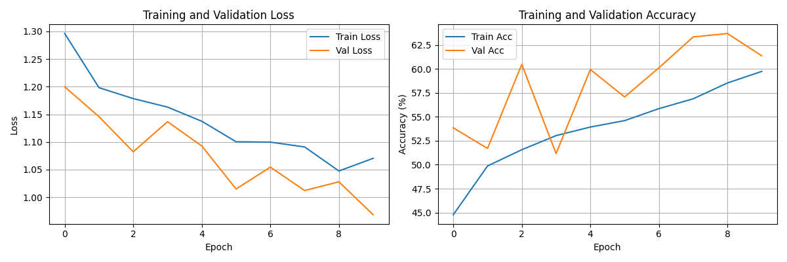

**Confusion Matrix:**
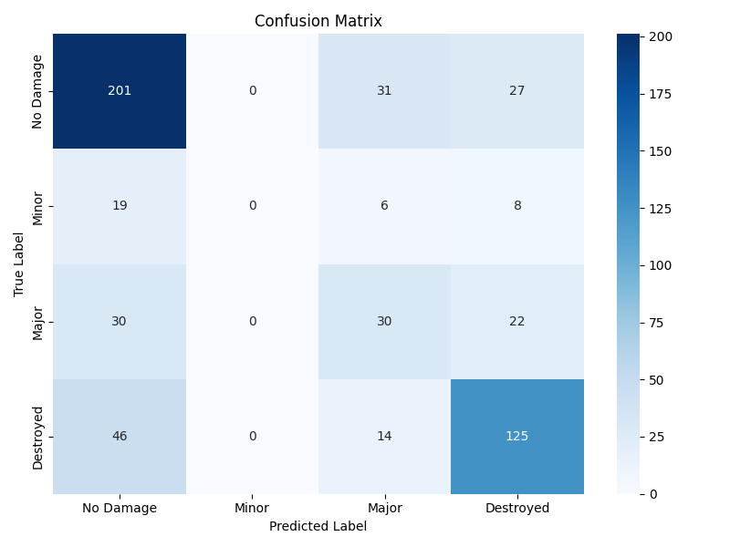

**Performance by Class:**

| Class | Precision | Recall | F1-Score | Support |
|-------|-----------|--------|----------|---------|
| No Damage | 0.68 | 0.78 | 0.72 | 259 |
| Minor | 0.00 | 0.00 | 0.00 | 33 |
| Major | 0.37 | 0.37 | 0.37 | 82 |
| Destroyed | 0.69 | 0.68 | 0.68 | 185 |

**Analysis:**
- Consistent minor class failure


## Experiment 3: Minor, Major, Destroyed Weight Increase

**Hyperparameters:**
- Epochs: 15
- Batch size: 16
- Learning rate: 0.001
- Class weights: [1.0, 5.0, 2.0, 2.0]

**Results:**
- **Accuracy:** 55%
- **Time:** 39 minutes
- **Best Epoch:** 7 (0-indexed)

**Training Progress:**
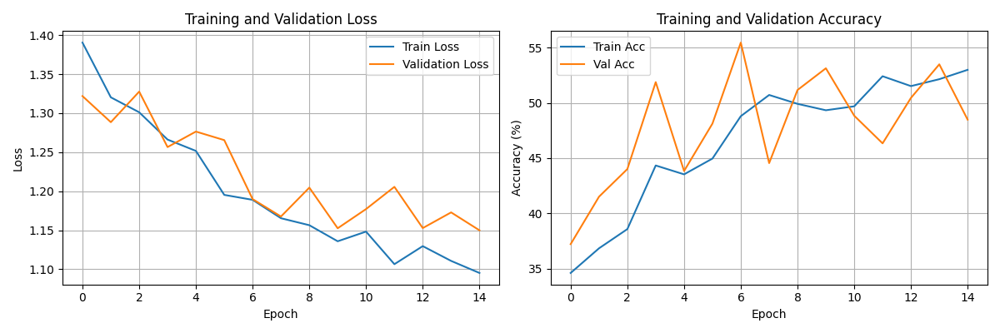

**Confusion Matrix:**
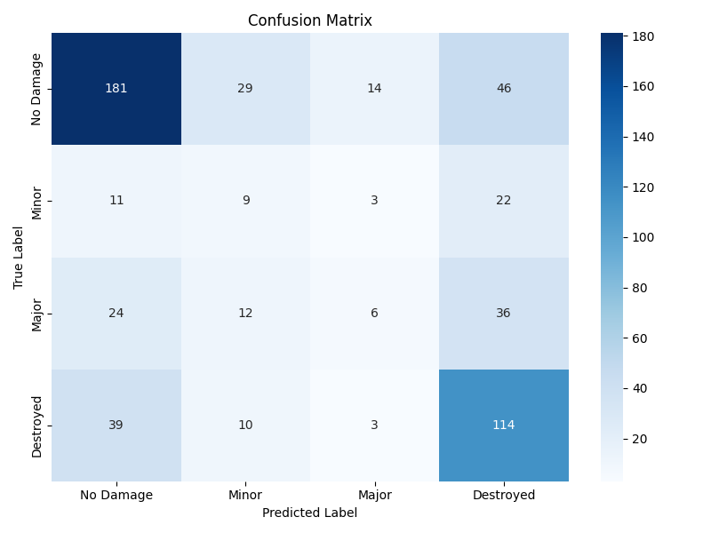

**Performance by Class:**
```text
              precision    recall  f1-score   support

   No Damage       0.71      0.67      0.69       270
       Minor       0.15      0.20      0.17        45
       Major       0.23      0.08      0.12        78
   Destroyed       0.52      0.69      0.59       166

    accuracy                           0.55       559
   macro avg       0.40      0.41      0.39       559
weighted avg       0.54      0.55      0.54       559
```

**Analysis:**
- Minor no longer has 0% correct predictions
- Other classes have suffered at the expense of minor improving
- Minor will be less prioritized. More important to send aid towards known damaged scenes

## Experiment 4: Decrease Minor Importance

**Hyperparameters:**
- Epochs: 12
- Batch size: 16
- Learning rate: 0.001
- Class weights: [1.0, 1.5, 2.0, 2.0]

**Results:**
- **Accuracy:** 58%
- **Time:** 35 minutes
- **Best Epoch:** 9 (0-indexed)

**Training Progress:**
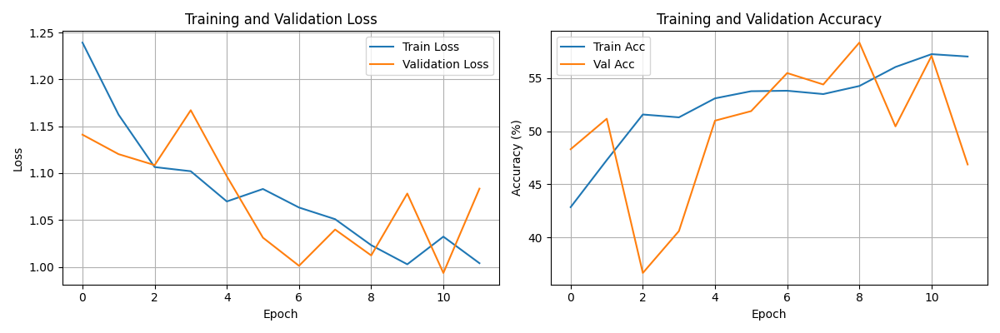

**Confusion Matrix:**
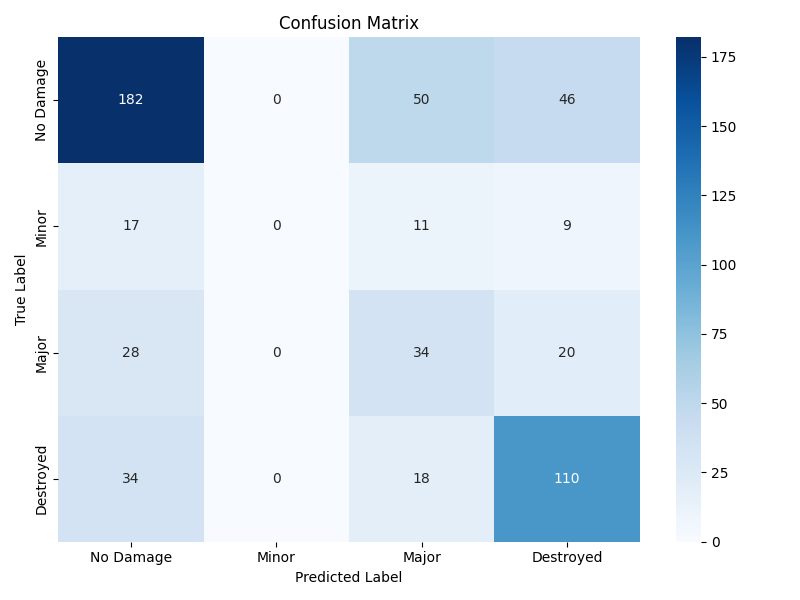

**Performance by Class:**
``` text
              precision    recall  f1-score   support

   No Damage       0.70      0.65      0.68       278
       Minor       0.00      0.00      0.00        37
       Major       0.30      0.41      0.35        82
   Destroyed       0.59      0.68      0.63       162

    accuracy                           0.58       559
   macro avg       0.40      0.44      0.41       559
weighted avg       0.56      0.58      0.57       559
```

**Analysis:**
- High overfitting accuracy at final epoch but not as great as at epoch 2
- Model began to degrade after epoch 8
- Need to take some inspiration from experiment 1


## Experiment 5: Class Weight Change

**Hyperparameters:**
- Epochs: 11
- Batch size: 16
- Learning rate: 0.001
- Class weights: [1.0, 1.75, 1.5, 1.25]

**Results:**
- **Accuracy:** 59%
- **Time:** 28 minutes
- **Best Epoch:** 8 (0-indexed)

**Training Progress:**
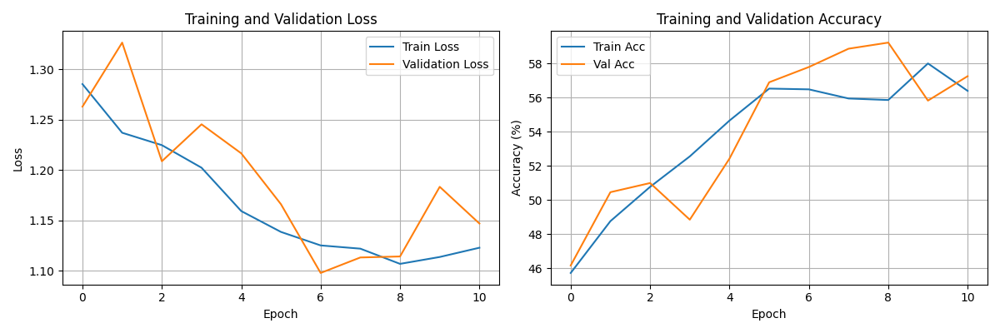

**Confusion Matrix:**
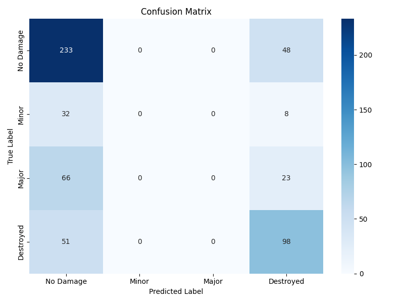

**Performance by Class:**
``` text
              precision    recall  f1-score   support

   No Damage       0.61      0.83      0.70       281
       Minor       0.00      0.00      0.00        40
       Major       0.00      0.00      0.00        89
   Destroyed       0.55      0.66      0.60       149

    accuracy                           0.59       559
   macro avg       0.29      0.37      0.33       559
weighted avg       0.45      0.59      0.51       559
```

**Analysis:**
- Correctly found more No Damage scenes than in experiment 1
- Destroyed images found were less than in experiment 1
- Need to ensure aid is not sent to No Damage zones as they're needed elsewhere, increase accuracy for No Damage
- Accuracy plateaus after epoch 5 (0-indexed)

## Experiment 6: Decrease No Damage Weight

**Hyperparameters:**
- Epochs: 11
- Batch size: 16
- Learning rate: 0.001
- Class weights: [0.7, 1.75, 1.5, 1.25]

**Results:**
- **Accuracy:** 61%
- **Time:** Not recorded
- **Best Epoch:** 5 (0-indexed)

**Training Progress:**
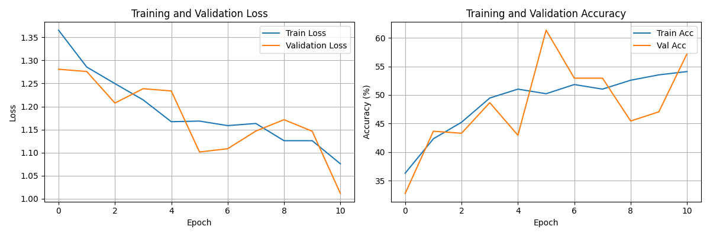

**Confusion Matrix:**


**Performance by Class:**
``` text
              precision    recall  f1-score   support

   No Damage       0.71      0.71      0.71       281
       Minor       0.00      0.00      0.00        33
       Major       0.36      0.35      0.36        82
   Destroyed       0.58      0.70      0.63       163

    accuracy                           0.61       559
   macro avg       0.41      0.44      0.43       559
weighted avg       0.58      0.61      0.59       559
```

**Analysis:**
- Slowly catching up to the 68% accuracy found in experiment 1
- Decrease No Damage Weight a little more to see if f1-score increases again

## Experiment 7: Decrease No Damage Weight 

**Hyperparameters:**
- Epochs: 11
- Batch size: 16
- Learning rate: 0.001
- Class weights: [0.5, 1.75, 1.5, 1.25]

**Results:**
- **Accuracy:** 56%
- **Time:** 26 minutes
- **Best Epoch:** 8 (0-indexed)

**Training Progress:**
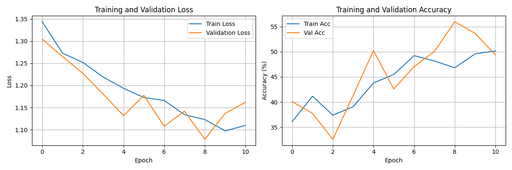

**Confusion Matrix:**
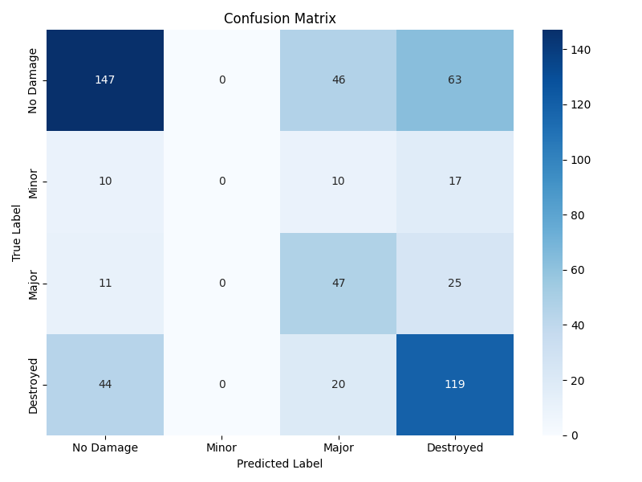

**Performance by Class:**
``` text
              precision    recall  f1-score   support

   No Damage       0.69      0.57      0.63       256
       Minor       0.00      0.00      0.00        37
       Major       0.38      0.57      0.46        83
   Destroyed       0.53      0.65      0.58       183

    accuracy                           0.56       559
   macro avg       0.40      0.45      0.42       559
weighted avg       0.55      0.56      0.55       559
```

**Analysis:**
- f1-score decreased
- Overall accuracy decreased
- No Damage weight decreased too much
- Change No Damage back to .7 and Destroyed to 1.5

## Experiment 8: No Damage and Destroyed Weight Increase

**Hyperparameters:**
- Epochs: 11
- Batch size: 16
- Learning rate: 0.001
- Class weights: [0.7, 1.75, 1.5, 1.5]

**Results:**
- **Accuracy:** 59%
- **Time:** Not recorded
- **Best Epoch:** 9

**Training Progress:**
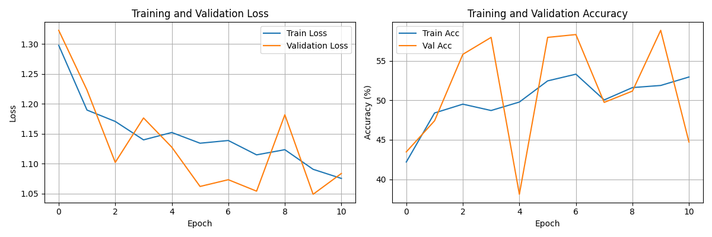

**Confusion Matrix:**


**Performance by Class:**
``` text
              precision    recall  f1-score   support

   No Damage       0.62      0.71      0.66       257
       Minor       0.00      0.00      0.00        43
       Major       0.35      0.32      0.33        78
   Destroyed       0.63      0.67      0.65       181

    accuracy                           0.59       559
   macro avg       0.40      0.43      0.41       559
weighted avg       0.54      0.59      0.56       559
```

**Analysis:**
- Better accuracy than previous experiment
- No Damage and Destroyed have better f1-scores but now as great as in experiment 2
- Restart from baseline

## Experiment 9: Increase Minor Weight

**Hyperparameters:**
- Epochs: 11
- Batch size: 16
- Learning rate: 0.001
- Class weights: [0.7, 2.0, 1.5, 1.5]

**Results:**
- **Accuracy:** 61%
- **Time:** 10:45 am - 11:12 am
- **Best Epoch:** 6

**Training Progress:**
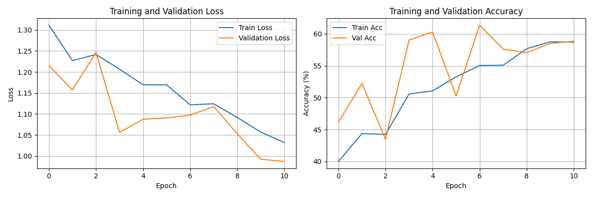

**Confusion Matrix:**
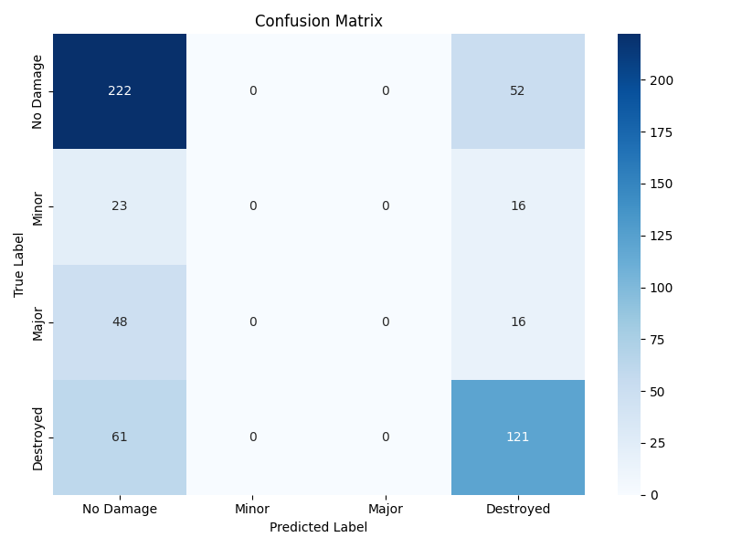

**Performance by Class:**
``` text
              precision    recall  f1-score   support

   No Damage       0.63      0.81      0.71       274
       Minor       0.00      0.00      0.00        39
       Major       0.00      0.00      0.00        64
   Destroyed       0.59      0.66      0.63       182

    accuracy                           0.61       559
   macro avg       0.30      0.37      0.33       559
weighted avg       0.50      0.61      0.55       559
```

**Analysis:**
- Accuracy is coming back up
- Validation loss reached below 1.00 for the first time
- Add more epochs since loss graph appears to still be decreasing more sharply than previous graphs

## Experiment 10: Add More Epochs

**Hyperparameters:**
- Epochs: 14
- Batch size: 16
- Learning rate: 0.001
- Class weights: [0.7, 2.0, 1.5, 1.5]

**Results:**
- **Accuracy:** 60%
- **Time:** 45 minutes
- **Best Epoch:** 10

**Training Progress:**
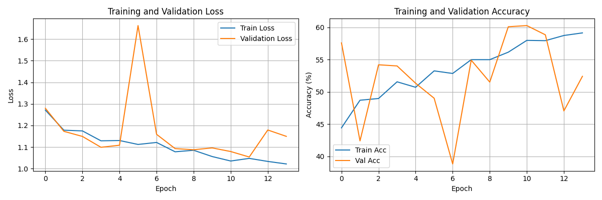

**Confusion Matrix:**
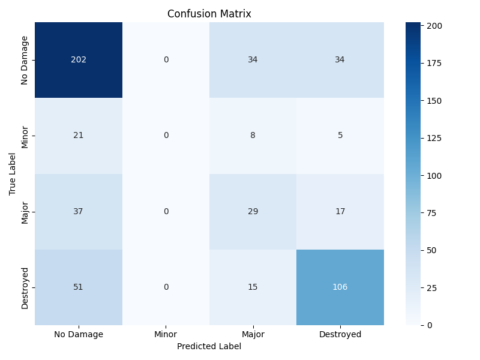

**Performance by Class:**
``` text
              precision    recall  f1-score   support

   No Damage       0.65      0.75      0.70       270
       Minor       0.00      0.00      0.00        34
       Major       0.34      0.35      0.34        83
   Destroyed       0.65      0.62      0.63       172

    accuracy                           0.60       559
   macro avg       0.41      0.43      0.42       559
weighted avg       0.57      0.60      0.58       559

```

**Analysis:**
- Very big spike between train and validation in epoch 5 in loss graph
- Very big spike beteween train and validation in epoch 6 in loss graph
- A bad case of luck from shuffling or random initilization from 80/20
- Major f1-score increased by 0.34 from previous experiment with same hyperparameters
- Find way to increase Destroyed f1-score then No Damage f1-score
- Try a faster learning rate next experiment

## Experiment 11: Decrease Destroyed Weight, Faster Learning Rate

**Hyperparameters:**
- Epochs: 14
- Batch size: 16
- Learning rate: 0.002
- Class weights: [0.7, 2.0, 1.5, 1.4]

**Results:**
- **Accuracy:** 46%
- **Time:** Not recorded
- **Best Epoch:** 0

**Training Progress:**
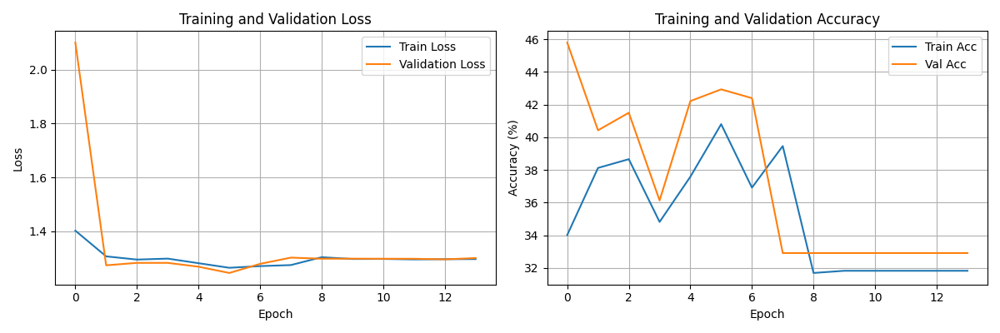

**Confusion Matrix:**
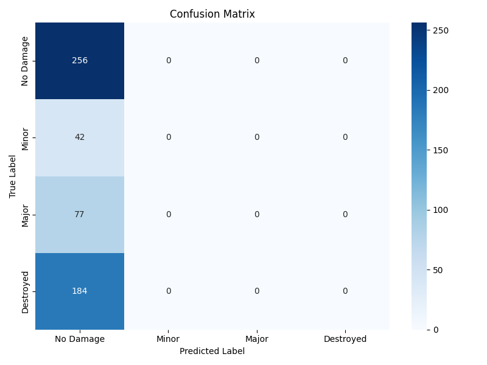

**Performance by Class:**
``` text
              precision    recall  f1-score   support

   No Damage       0.46      1.00      0.63       256
       Minor       0.00      0.00      0.00        42
       Major       0.00      0.00      0.00        77
   Destroyed       0.00      0.00      0.00       184

    accuracy                           0.46       559
   macro avg       0.11      0.25      0.16       559
weighted avg       0.21      0.46      0.29       559

```

**Analysis:**
- Undo the learning rate
- Plateaued way to soon
- Too many jumps

## Experiment 12: Learning Rate Back to 0.001

**Hyperparameters:**
- Epochs: 14
- Batch size: 16
- Learning rate: 0.001
- Class weights: [0.7, 2.0, 1.5, 1.4]

**Results:**
- **Accuracy:** 62%
- **Time:** Not recorded
- **Best Epoch:** 2

**Training Progress:**
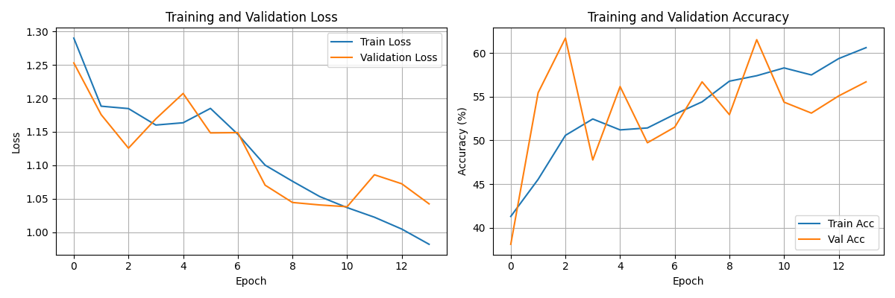

**Confusion Matrix:**
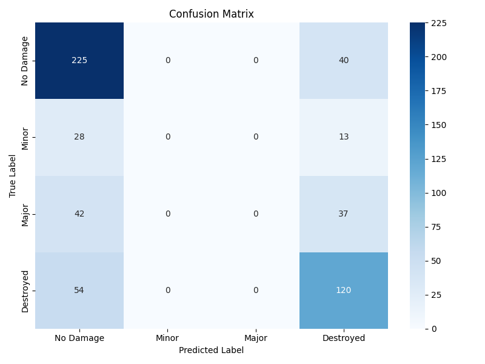

**Performance by Class:**
``` text
              precision    recall  f1-score   support

   No Damage       0.64      0.85      0.73       265
       Minor       0.00      0.00      0.00        41
       Major       0.00      0.00      0.00        79
   Destroyed       0.57      0.69      0.62       174

    accuracy                           0.62       559
   macro avg       0.30      0.38      0.34       559
weighted avg       0.48      0.62      0.54       559
```

**Analysis:**
- Continues to decrease in loss graph
- Conintues to increase in accuracy graph
- Reducing learning rate made performance better
- More epochs until plateau is seen
- Little overfitting seen in loss graph
- Validiation line in accuracy graph jumps around a bit but at least it's around training line
- Training continues to show growth in accuracy
- Predicted no Major Damage at all

## Experiment 13: Increase Epoch

**Hyperparameters:**
- Epochs: 19
- Batch size: 16
- Learning rate: 0.001
- Class weights: [0.7, 2.0, 1.5, 1.4]

**Results:**
- **Accuracy:** 60%
- **Time:** Not recorded
- **Best Epoch:** 17

**Training Progress:**
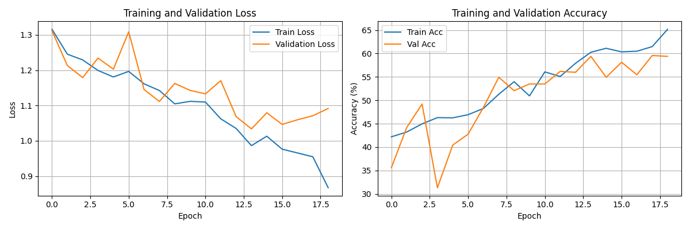

**Confusion Matrix:**
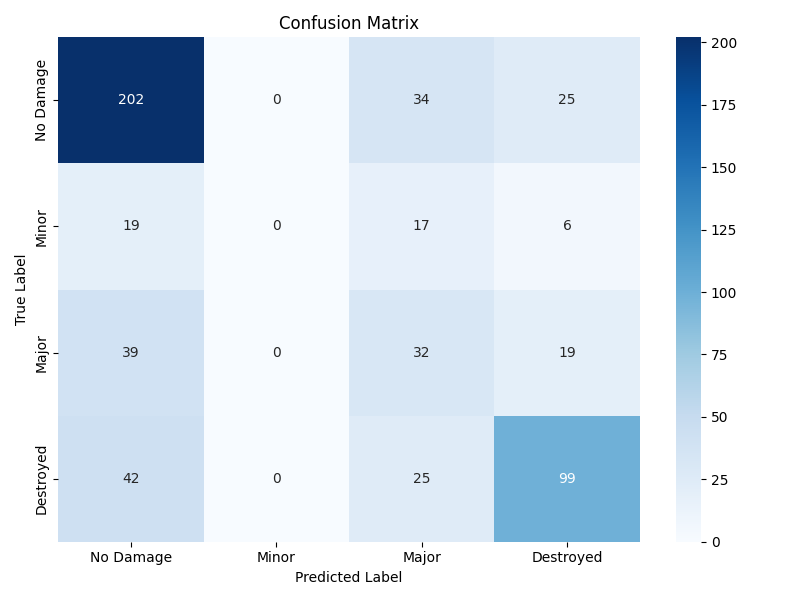

**Performance by Class:**
``` text
              precision    recall  f1-score   support

   No Damage       0.67      0.77      0.72       261
       Minor       0.00      0.00      0.00        42
       Major       0.30      0.36      0.32        90
   Destroyed       0.66      0.60      0.63       166

    accuracy                           0.60       559
   macro avg       0.41      0.43      0.42       559
weighted avg       0.56      0.60      0.57       559
```

**Analysis:**
- Beginning to overfit after epoch 15 in loss graph
- Decrease amount of epoch down to 16
- Need to start increasing Major Damage weight

## Experiment 14: Less Epoch, More Major Damage Weight

**Hyperparameters:**
- Epochs: 16
- Batch size: 16
- Learning rate: 0.001
- Class weights: [0.7, 2.0, 1.6, 1.4]

**Results:**
- **Accuracy:** 52.95%
- **Time:** Not recorded
- **Best Epoch:** 12

**Training Progress:**
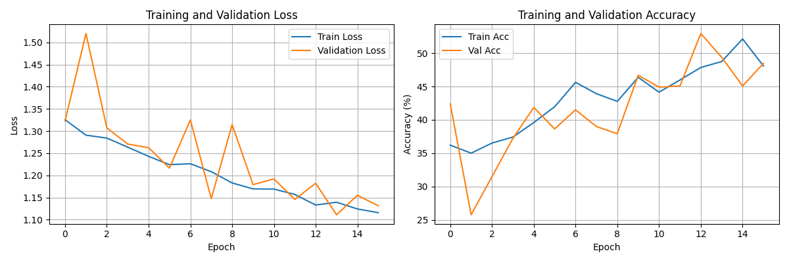

**Confusion Matrix:**
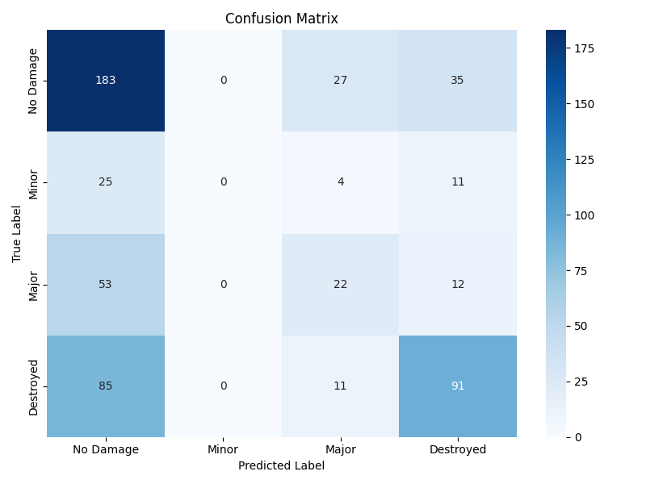

**Performance by Class:**
``` text
              precision    recall  f1-score   support

   No Damage       0.53      0.75      0.62       245
       Minor       0.00      0.00      0.00        40
       Major       0.34      0.25      0.29        87
   Destroyed       0.61      0.49      0.54       187

    accuracy                           0.53       559
   macro avg       0.37      0.37      0.36       559
weighted avg       0.49      0.53      0.50       559
```

**Analysis:**
- Performed worse
- Try even more weight in Major Damage to get more predictions in
- Loss is still decreasing. Up the epoch again

## Experiment 15: More Major Damage Weight, More Epoch

**Hyperparameters:**
- Epochs: 17
- Batch size: 16
- Learning rate: 0.001
- Class weights: [0.7, 2.0, 2.0, 1.4]

**Results:**
- **Accuracy:** 61%
- **Time:** 40 minutes
- **Best Epoch:** 14

**Training Progress:**
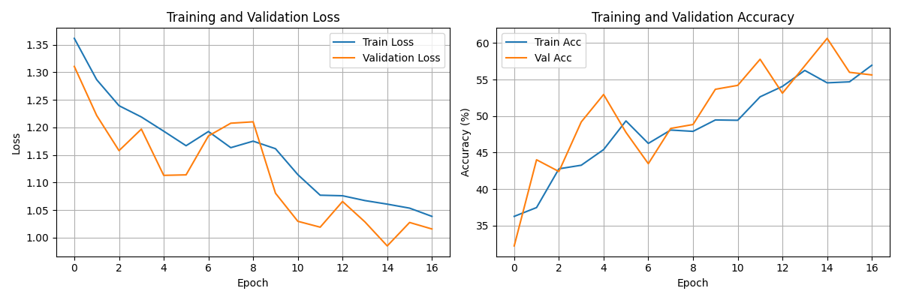

**Confusion Matrix:**
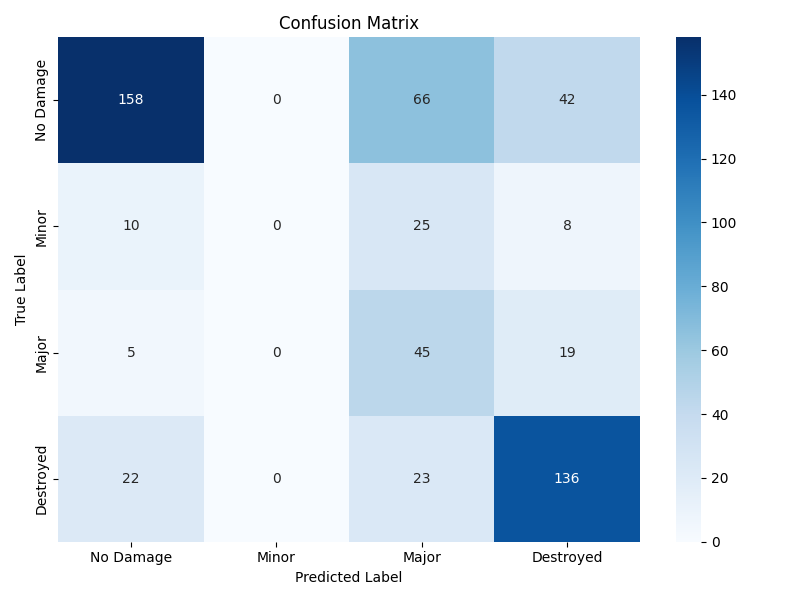

**Performance by Class:**
``` text
              precision    recall  f1-score   support

   No Damage       0.81      0.59      0.69       266
       Minor       0.00      0.00      0.00        43
       Major       0.28      0.65      0.39        69
   Destroyed       0.66      0.75      0.70       181

    accuracy                           0.61       559
   macro avg       0.44      0.50      0.45       559
weighted avg       0.64      0.61      0.60       559
```

**Analysis:**
- More Major Damage recalls but not very accurate at predicting them
- Major Damage taking away from No Damage labels
- No damage and Destroyed have good f1-scores
- Need to make Major predictions more accurate
- Slight decrease in Major Damage for next experiment
- Loss is decreasing without problem
- Accuracy is increasing without problem

## Experiment 16: Major Damage Decrease, Epoch Increase

**Hyperparameters:**
- Epochs: 18
- Batch size: 16
- Learning rate: 0.001
- Class weights: [0.7, 2.0, 1.85, 1.4]

**Results:**
- **Accuracy:** 59%
- **Time:** 43 minutes
- **Best Epoch:** 17

**Training Progress:**
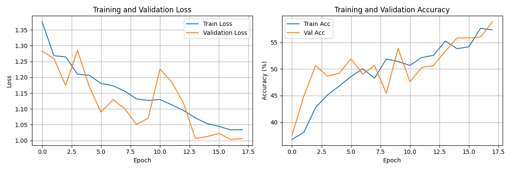

**Confusion Matrix:**
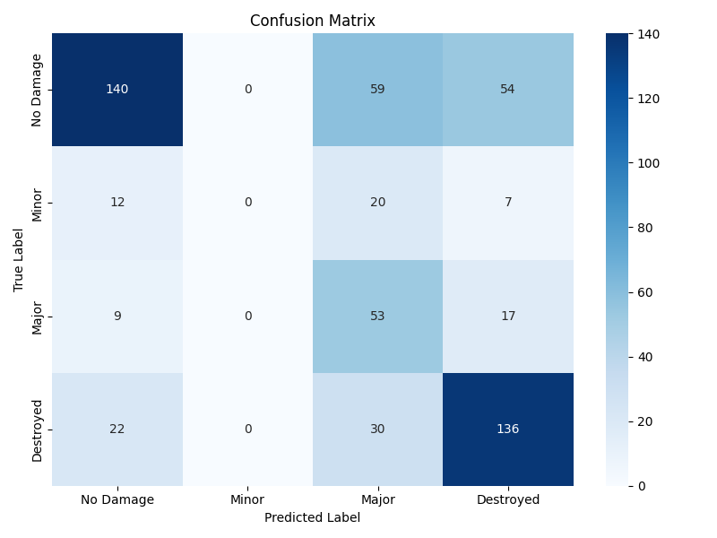

**Performance by Class:**
``` text
              precision    recall  f1-score   support

   No Damage       0.77      0.55      0.64       253
       Minor       0.00      0.00      0.00        39
       Major       0.33      0.67      0.44        79
   Destroyed       0.64      0.72      0.68       188

    accuracy                           0.59       559
   macro avg       0.43      0.49      0.44       559
weighted avg       0.61      0.59      0.58       559
```

**Analysis:**
- Higher Major Damage recall but low score still. 
- Lowest loss is no longer under 1.00

## Experiment 17: +0.1 Brightness, Contrast, +0.2 Saturation

**Hyperparameters:**
- Epochs: 18
- Batch size: 16
- Learning rate: 0.001
- Class weights: [0.7, 2.0, 1.85, 1.4]

**Results:**
- **Accuracy:** 63%
- **Time:** 45 minutes
- **Best Epoch:** 17

**Training Progress:**
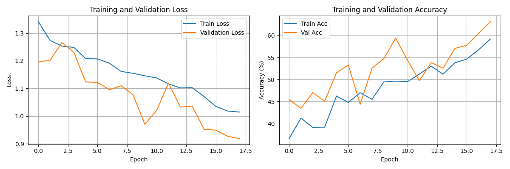

**Confusion Matrix:**
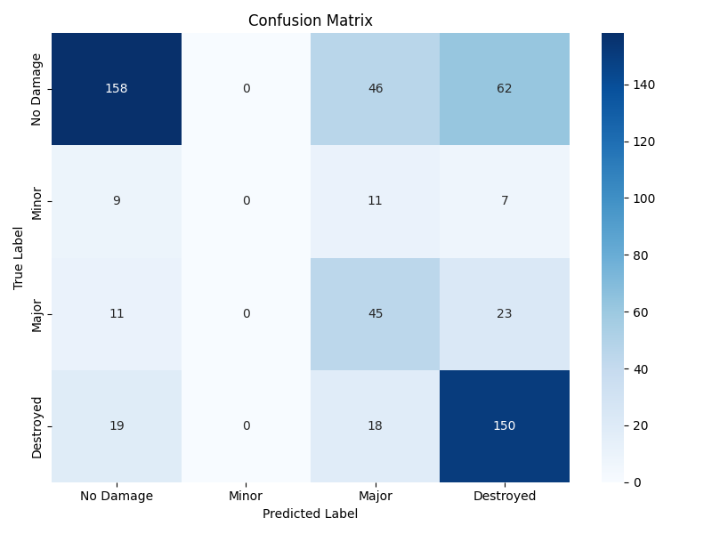

**Performance by Class:**
``` text
              precision    recall  f1-score   support

   No Damage       0.80      0.59      0.68       266
       Minor       0.00      0.00      0.00        27
       Major       0.38      0.57      0.45        79
   Destroyed       0.62      0.80      0.70       187

    accuracy                           0.63       559
   macro avg       0.45      0.49      0.46       559
weighted avg       0.64      0.63      0.62       559
```

**Analysis:**
- Performed slightly better

## Experiment 18: Experiment 1 Class Weights

**Hyperparameters:**
- Epochs: 18
- Batch size: 16
- Learning rate: 0.001
- Class weights: [1.0, 2.0, 1.5, 1.5]

**Results:** 
- **Accuracy:** 62%
- **Time:** 45 minutes
- **Best Epoch:** 17

**Training Progress:**
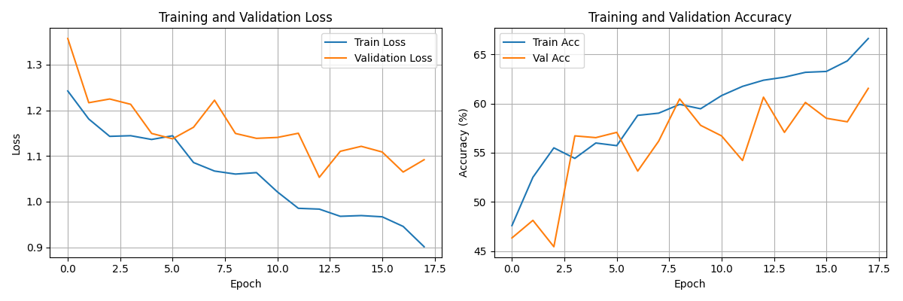

**Confusion Matrix:**
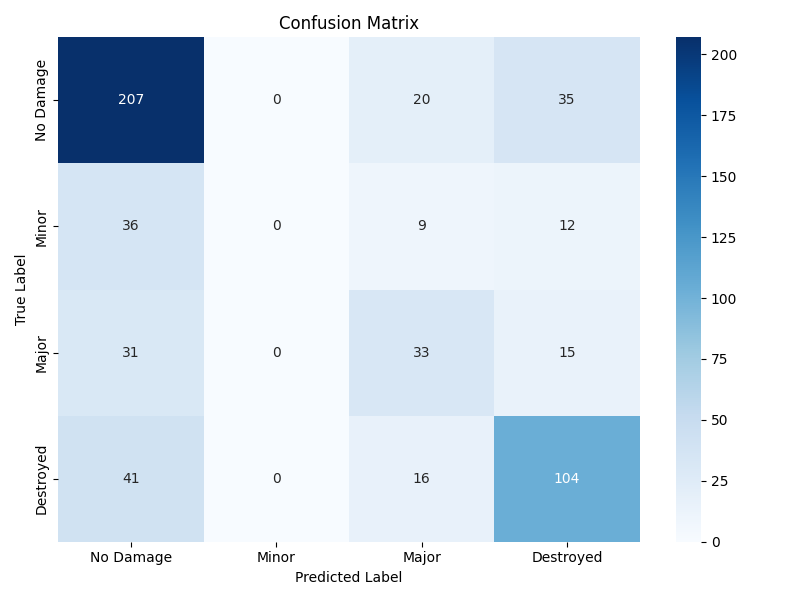

**Performance by Class:**
``` text
              precision    recall  f1-score   support

   No Damage       0.66      0.79      0.72       262
       Minor       0.00      0.00      0.00        57
       Major       0.42      0.42      0.42        79
   Destroyed       0.63      0.65      0.64       161

    accuracy                           0.62       559
   macro avg       0.43      0.46      0.44       559
weighted avg       0.55      0.62      0.58       559
```

**Analysis:**
- Graphs show better results despite being 61% accurate
- 0.9 y axis appearing in loss graph
- Training accuracy above 65% in accuracy graph
- Overfitting in loss graph after epoch 6 grows slowly bigger

## Experiment 19: Increase Minor Weight

**Hyperparameters:**
- Epochs: 18
- Batch size: 16
- Learning rate: 0.001
- Class weights: [1.0, 2.2, 1.5, 1.5]

**Results:**
- **Accuracy:** 62%
- **Time:** 43 minutes
- **Best Epoch:** 17

**Training Progress:**
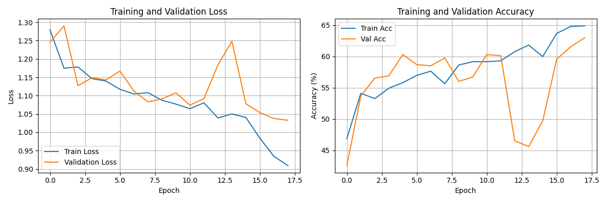

**Confusion Matrix:**
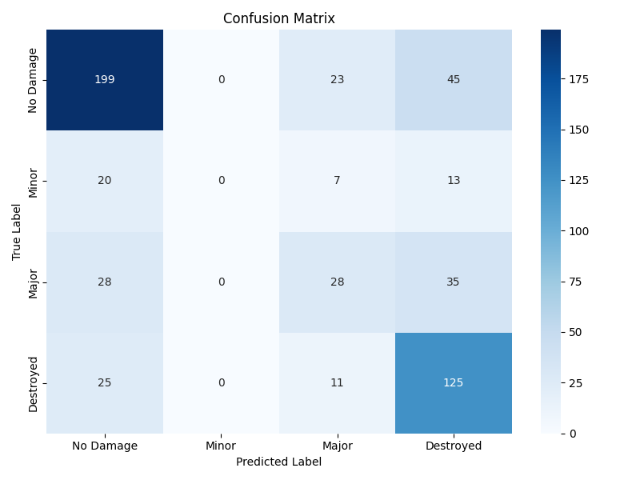

**Performance by Class:**
``` text
              precision    recall  f1-score   support

   No Damage       0.73      0.75      0.74       267
       Minor       0.00      0.00      0.00        40
       Major       0.41      0.31      0.35        91
   Destroyed       0.57      0.78      0.66       161

    accuracy                           0.63       559
   macro avg       0.43      0.46      0.44       559
weighted avg       0.58      0.63      0.60       559
```

**Analysis:**
- Redo experiment. Massive spike in epoch 12 and 13 that skewed results. 
- Training loss is farther away form 0.9 than previous experiment
- Training loss is farther away from 65 than in previous experiment
- More epoch as loss graph is still decreasing
- More epoch as accuracy graph is still increasing
- Amount of Minor Damage in dataset so low it should be ignored

## Experiment 20: Decrease Minor Weight

**Hyperparameters:**
- Epochs: 22
- Batch size: 16
- Learning rate: 0.001
- Class weights: [1.0, 1.0, 1.5, 1.5]

**Results:**
- **Accuracy:** 63%
- **Time:**
- **Best Epoch:** 18

**Training Progress:**
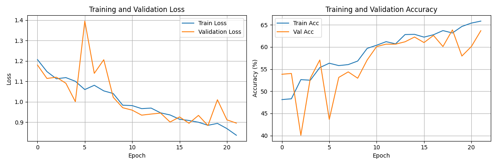

**Confusion Matrix:**
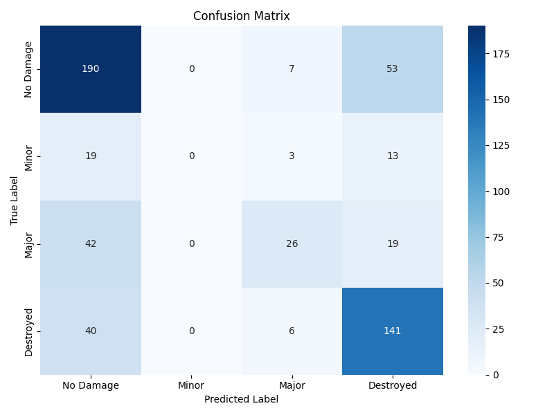

**Performance by Class:**
``` text
              precision    recall  f1-score   support

   No Damage       0.65      0.76      0.70       250
       Minor       0.00      0.00      0.00        35
       Major       0.62      0.30      0.40        87
   Destroyed       0.62      0.75      0.68       187

    accuracy                           0.64       559
   macro avg       0.47      0.45      0.45       559
weighted avg       0.60      0.64      0.61       559
```

**Analysis:**

## Experiment 21: -0.1 Brightness, Contrast, -0.2 Saturation, +1.0 Minor Damage

**Hyperparameters:**
- Epochs: 22
- Batch size: 16
- Learning rate: 0.001
- Class weights: [1.0, 2.0, 1.5, 1.5]

**Results:**
- **Accuracy:** 62%
- **Time:** 55 minutes
- **Best Epoch:** 20

**Training Progress:**
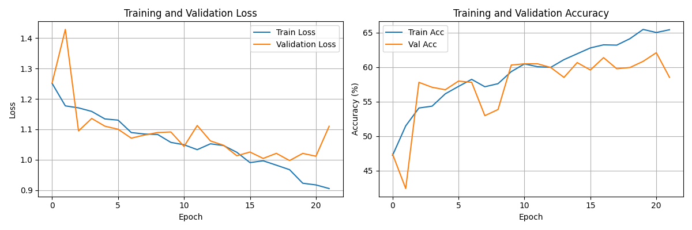

**Confusion Matrix:**
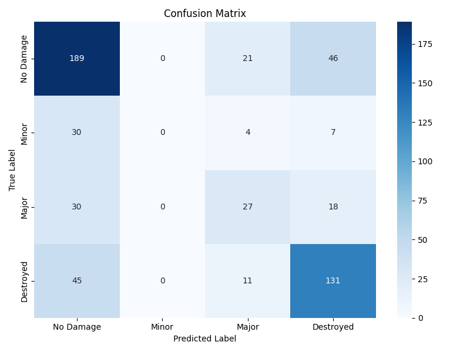

**Performance by Class:**
``` text
              precision    recall  f1-score   support

   No Damage       0.64      0.74      0.69       256
       Minor       0.00      0.00      0.00        41
       Major       0.43      0.36      0.39        75
   Destroyed       0.65      0.70      0.67       187

    accuracy                           0.62       559
   macro avg       0.43      0.45      0.44       559
weighted avg       0.57      0.62      0.59       559
```

**Analysis:**
- Need to stop after epoch 17. Begins to overfit too frequently
- Change objective from finding overall accuracy to making Destroyed most accurate
- Next plan: 2 experiments at uniform class weight (more if large spike seen in graph), then with saturation 0.2, then with resnet50 depending on performance better with or without saturation
- Next plan: 2 experiments using inverse frequency without diminishing the values like in experiment 1, then with resnet50 depending on performance better with or without saturation

## Experiment 22: Uniform Class Weight, No Saturation

**Hyperparameters:**
- Epochs: 17
- Batch size: 16
- Learning rate: 0.001
- Class weights: [1.0, 1.0, 1.0, 1.0]

**Results:**
- **Accuracy:** 66%
- **Time:** 41 minutes
- **Best Epoch:** 16

**Training Progress:**
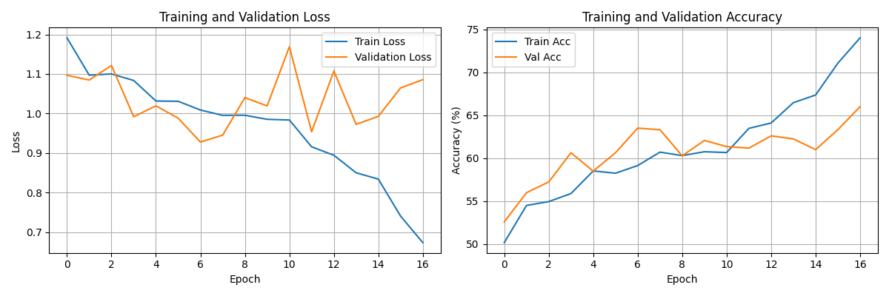

**Confusion Matrix:**
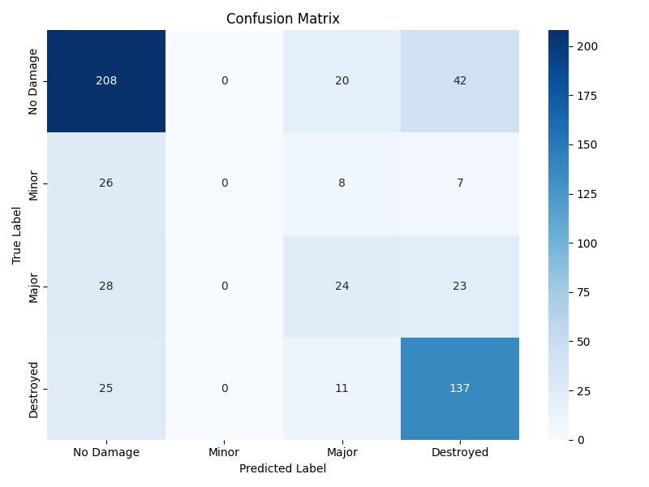

**Performance by Class:**
``` text
              precision    recall  f1-score   support

   No Damage       0.72      0.77      0.75       270
       Minor       0.00      0.00      0.00        41
       Major       0.38      0.32      0.35        75
   Destroyed       0.66      0.79      0.72       173

    accuracy                           0.66       559
   macro avg       0.44      0.47      0.45       559
weighted avg       0.60      0.66      0.63       559
```

**Analysis:**
- Highest No Damage f1-score so far
- Highest Destroyed f1-score so far
- Should have started with these values
- Even though it's not the highest overall accuracy, it is accurate at determining Destroyed locations and No Damage locations
- Lots of overfitting starting at epoch 13 in both graphs

## Experiment 23: Rerun Experiment 22

**Hyperparameters:**
- Epochs: 17
- Batch size: 16
- Learning rate: 0.001
- Class weights: [1.0, 1.0, 1.0, 1.0]

**Results:**
- **Accuracy:** 67%
- **Time:** 42 minutes
- **Best Epoch:** 12

**Training Progress:**
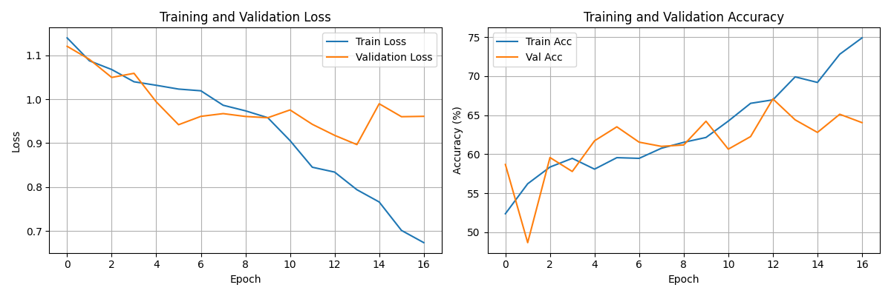

**Confusion Matrix:**
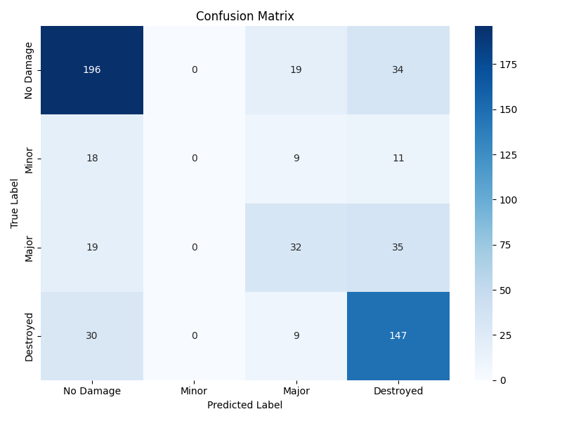

**Performance by Class:**
``` text
              precision    recall  f1-score   support

   No Damage       0.75      0.79      0.77       249
       Minor       0.00      0.00      0.00        38
       Major       0.46      0.37      0.41        86
   Destroyed       0.65      0.79      0.71       186

    accuracy                           0.67       559
   macro avg       0.46      0.49      0.47       559
weighted avg       0.62      0.67      0.64       559
```

**Analysis:**
- Overfitting after epoch 13 in both graphs
- f1-score for No Damage is best so far
- Overall best hyperparameters so far
- Thinking back on experiment 1, may have just been extremely lucky

## Experiment 24: Less Epoch, Saturation +0.2

**Hyperparameters:**
- Epochs: 14
- Batch size: 16
- Learning rate: 0.001
- Class weights: [1.0, 1.0, 1.0, 1.0]

**Results:**
- **Accuracy:** 62%
- **Time:** 36 minutes
- **Best Epoch:** 11

**Training Progress:**
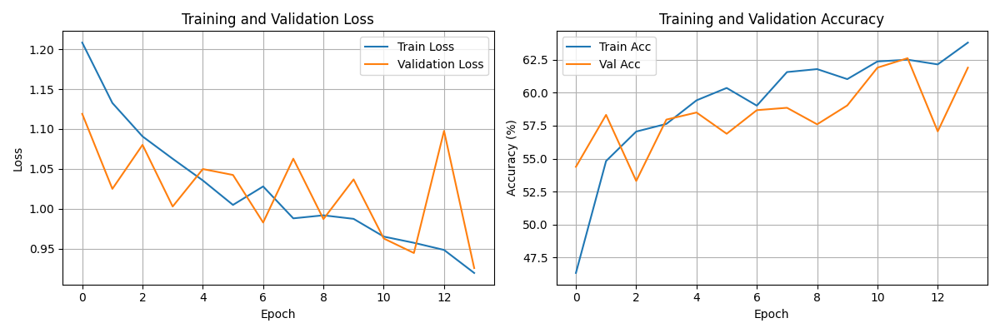

**Confusion Matrix:**
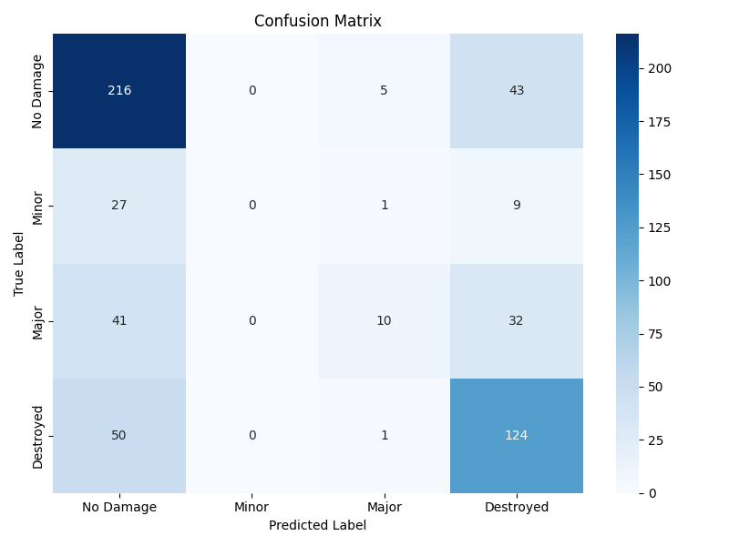

**Performance by Class:**
``` text
              precision    recall  f1-score   support

   No Damage       0.65      0.82      0.72       264
       Minor       0.00      0.00      0.00        37
       Major       0.59      0.12      0.20        83
   Destroyed       0.60      0.71      0.65       175

    accuracy                           0.63       559
   macro avg       0.46      0.41      0.39       559
weighted avg       0.58      0.63      0.57       559
```

**Analysis:**
- Validation is unstable in loss graph
- Major Damage has an f1-score that decreased by half

## Experiment 25: Rerun Experiment 24

**Hyperparameters:**
- Epochs: 14
- Batch size: 16
- Learning rate: 0.001
- Class weights: [1.0, 1.0, 1.0, 1.0]

**Results:**
- **Accuracy:** 60%
- **Time:** 34 minutes
- **Best Epoch:** 10

**Training Progress:**
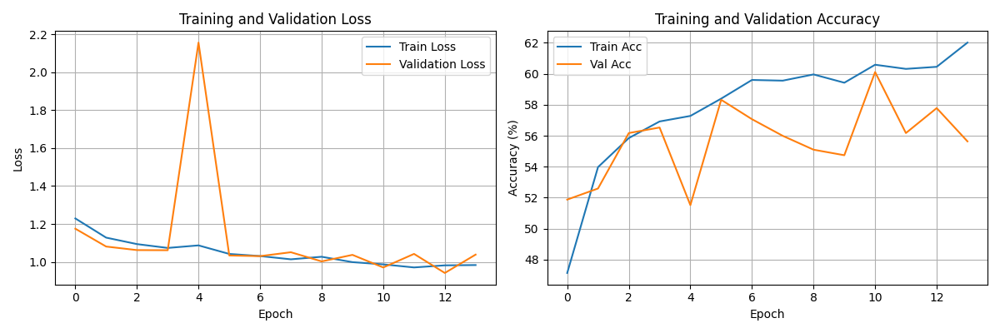

**Confusion Matrix:**
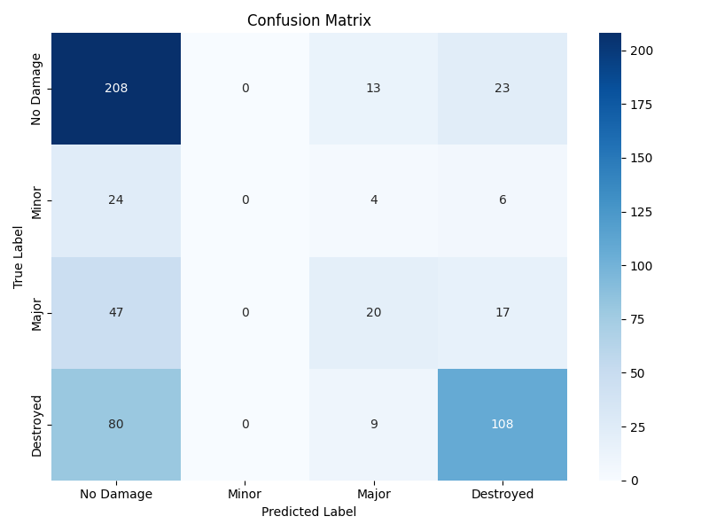

**Performance by Class:**
``` text

```

**Analysis:**
- Performed worse with saturation +0.2
- Validation loss spike almost reached 2.2 at epoch 4
- No saturation is the better choice

## Experiment 26: Experiment 22 with ResNet50

**Hyperparameters:**
- Epochs: 14
- Batch size: 16
- Learning rate: 0.001
- Class weights: [1.0, 1.0, 1.0, 1.0]

**Results:**
- **Accuracy:** 64%
- **Time:** 38 minutes
- **Best Epoch:** 13

**Training Progress:**
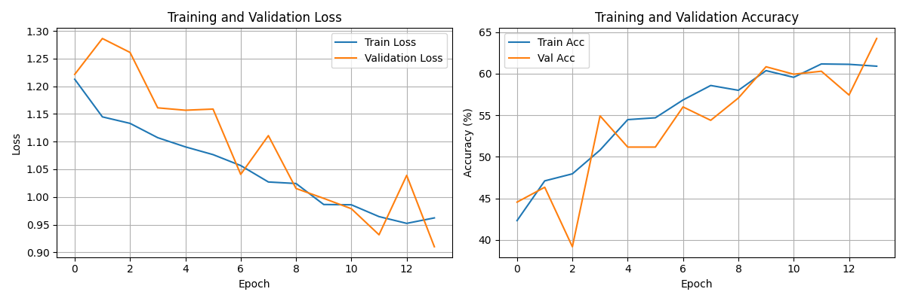

**Confusion Matrix:**
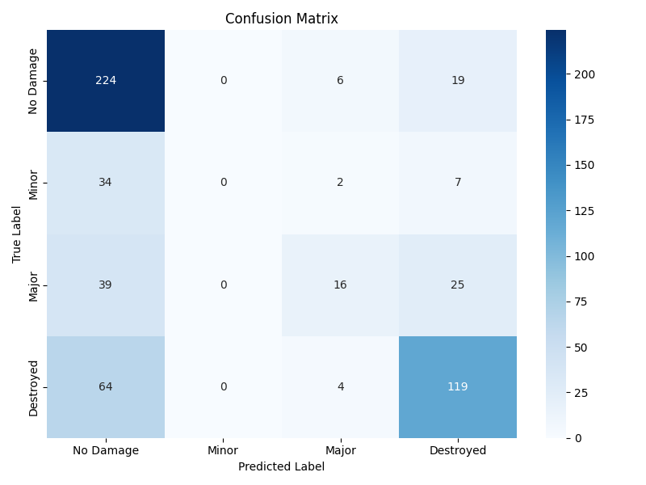

**Performance by Class:**
``` text
              precision    recall  f1-score   support

   No Damage       0.62      0.90      0.73       249
       Minor       0.00      0.00      0.00        43
       Major       0.57      0.20      0.30        80
   Destroyed       0.70      0.64      0.67       187

    accuracy                           0.64       559
   macro avg       0.47      0.43      0.42       559
weighted avg       0.59      0.64      0.59       559
```

**Analysis:**
- Maybe try a little more epoch, but looks as if it will begin to overfit
- Performed worse in Destroyed f1-score

## Experiment 27: Rerun Experiment 26

**Hyperparameters:**
- Epochs: 17
- Batch size: 16
- Learning rate: 0.001
- Class weights: [1.0, 1.0, 1.0, 1.0]

**Results:**
- **Accuracy:** 62%
- **Time:** 51 minutes
- **Best Epoch:** 15

**Training Progress:**
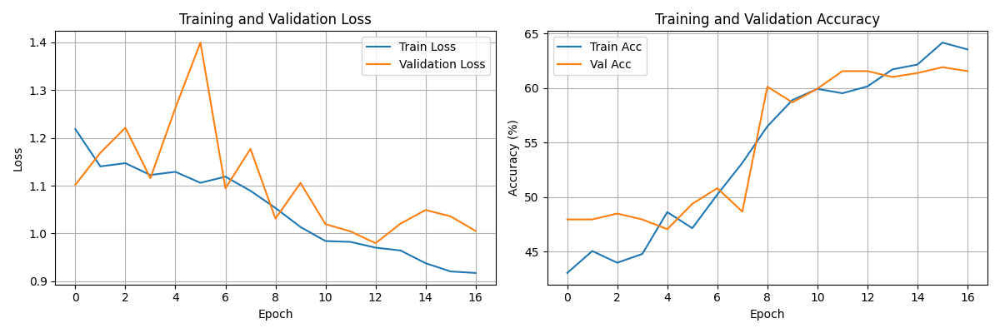

**Confusion Matrix:**
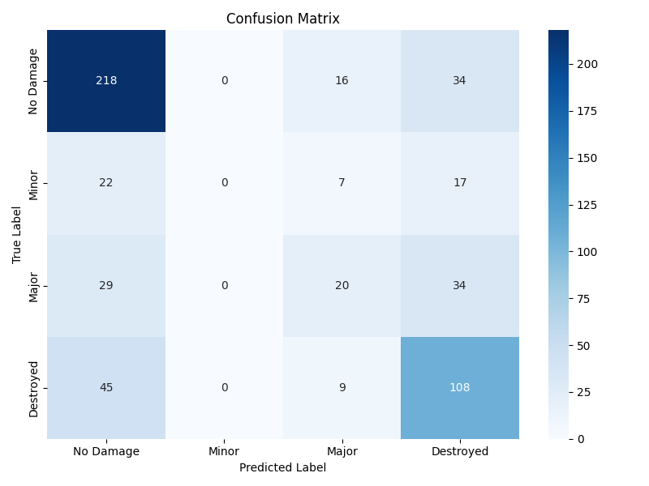

**Performance by Class:**
``` text
              precision    recall  f1-score   support

   No Damage       0.69      0.81      0.75       268
       Minor       0.00      0.00      0.00        46
       Major       0.38      0.24      0.30        83
   Destroyed       0.56      0.67      0.61       162

    accuracy                           0.62       559
   macro avg       0.41      0.43      0.41       559
weighted avg       0.55      0.62      0.58       559
```

**Analysis:**
- It seems with ResNet50 there begins to form a lot of loss spikes
- Performed better with ResNet18 in Experiment 22
- New Plan: Perform 2 experiments inverse frequency with ResNet18, no saturation boost or ResNet50

## Experiment 28: Inverse Frequency, ResNet50

**Hyperparameters:**
- Epochs: 14
- Batch size: 16
- Learning rate: 0.001
- Class weights: [1.0, 6.8, 3.1, 1.4]

**Results:**
- **Accuracy:** 52%
- **Time:** 42 minutes
- **Best Epoch:** 11

**Training Progress:**
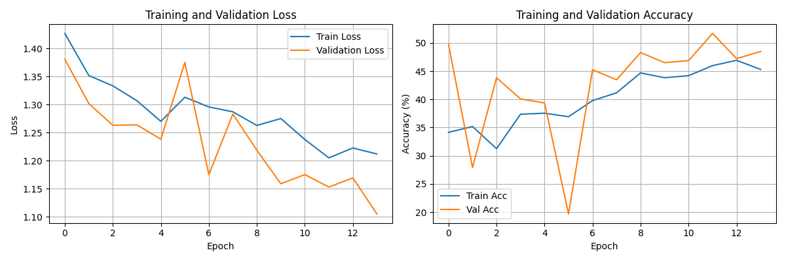

**Confusion Matrix:**
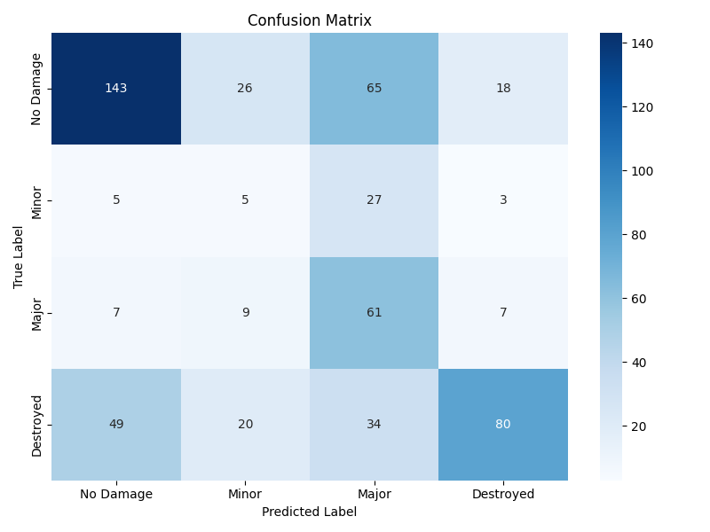

**Performance by Class:**
``` text
              precision    recall  f1-score   support

   No Damage       0.70      0.57      0.63       252
       Minor       0.08      0.12      0.10        40
       Major       0.33      0.73      0.45        84
   Destroyed       0.74      0.44      0.55       183

    accuracy                           0.52       559
   macro avg       0.46      0.46      0.43       559
weighted avg       0.61      0.52      0.54       559
```

**Analysis:**
- Performed very badly by training loss not even reaching 50% in accuracy graph
- No within 1.0 loss in loss graph with both training and validation

## Experiment 29: Inverse Frequency, ResNet18

**Hyperparameters:**
- Epochs: 14
- Batch size: 16
- Learning rate: 0.001
- Class weights: [1.0, 6.8, 3.1, 1.4]

**Results:**
- **Accuracy:** 48%
- **Time:** 35 minutes
- **Best Epoch:** 9

**Training Progress:**
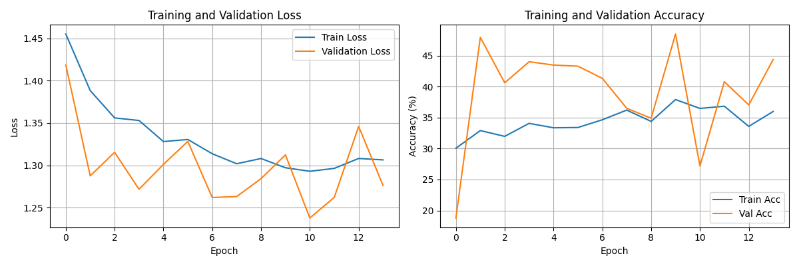

**Confusion Matrix:**
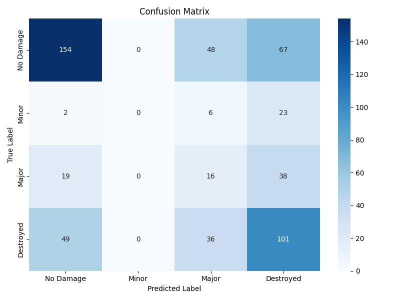

**Performance by Class:**
``` text
              precision    recall  f1-score   support

   No Damage       0.69      0.57      0.62       269
       Minor       0.00      0.00      0.00        31
       Major       0.15      0.22      0.18        73
   Destroyed       0.44      0.54      0.49       186

    accuracy                           0.48       559
   macro avg       0.32      0.33      0.32       559
weighted avg       0.50      0.48      0.49       559
```

**Analysis:**
- Results are even worse
- Training and validation loss aren't even below 1.10 loss
- Training accuracy did not surpass 40%
- Default Class Weights of 1.00 seem to be best results yet for predicting No Damage and Destroyed classes